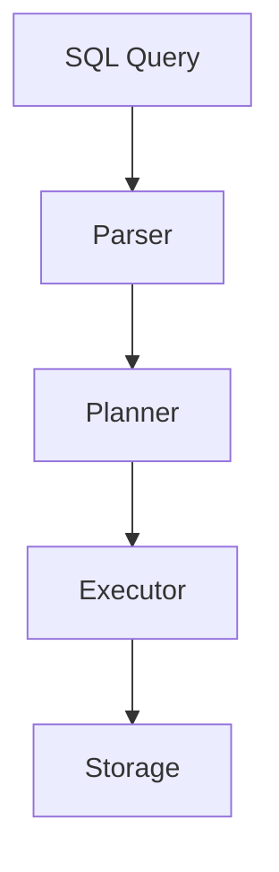

# Documentation Guide

## Overview

This directory contains comprehensive documentation tracking our journey building VibeSQL, a FULL SQL:1999 compliant in-memory database.

## Documentation Philosophy

As we work through this unprecedented challenge, we maintain detailed documentation to:
- **Track decisions**: Why we chose specific approaches
- **Capture learning**: Insights gained during implementation
- **Document architecture**: System design and component interactions
- **Record progress**: What works, what doesn't, what's next
- **Enable future contributors**: Make the codebase understandable

## Directory Structure

```
docs/
├── README.md                    # This file - documentation guide
├── SUMMARY.md                   # Navigation index and quick access guide
├── CLI_GUIDE.md                 # Complete CLI user guide
├── PUBLISHING_CHECKLIST.md      # Release process checklist
├── PYTHON_BINDINGS.md           # Python integration guide
│
├── planning/                    # Strategic planning documents
│   ├── ROADMAP_CORE_COMPLIANCE.md  # 10-phase plan to Core compliance
│   ├── PROBLEM_STATEMENT.md     # Original challenge
│   ├── REQUIREMENTS.md          # Project requirements
│   ├── PARALLELISM_STRATEGY.md  # Parallelism implementation plan
│   └── PERSISTENCE_AND_DOGFOODING.md
│
├── roadmaps/                    # Strategic roadmaps
│   ├── PARALLELISM_ROADMAP.md   # Parallelism roadmap
│   ├── PREDICATE_PUSHDOWN_ROADMAP.md  # Optimization roadmap
│   ├── PUNCHLIST_100_CONFORMANCE.md   # SQLLogicTest conformance strategy
│   ├── PUNCHLIST_README.md      # Punchlist system documentation
│   └── PUNCHLIST_MANIFEST.md    # Complete deliverables manifest
│
├── testing/                     # Testing strategy and guides
│   ├── TESTING_STRATEGY.md      # Test approach and strategy
│   ├── TESTING.md               # General testing documentation
│   ├── SQL1999_CONFORMANCE.md   # SQL:1999 conformance tracking
│   ├── VALIDATION_RESULTS.md    # Test validation results
│   ├── conformance.html         # Visual conformance report
│   └── sqllogictest/            # SQLLogicTest suite documentation
│       ├── SQLLOGICTEST_QUICKSTART.md   # 30-second introduction
│       ├── SQLLOGICTEST_DATABASE.md     # Complete documentation
│       ├── QUICK_START.md       # Quick start guide
│       └── ...
│
├── performance/                 # Performance & optimization
│   ├── BENCHMARKING.md          # Comprehensive benchmarking guide
│   ├── OPTIMIZATION.md          # Optimization strategies
│   ├── BENCHMARK_STRATEGY.md    # Benchmarking approach
│   ├── PERFORMANCE_ANALYSIS.md  # Profiling results
│   └── ...
│
├── reference/                   # Reference materials
│   ├── README.md                # Reference guide
│   ├── FEATURE_STATUS.md        # Feature implementation status
│   ├── PROCEDURES_FUNCTIONS.md  # Stored procedures documentation
│   ├── TRIGGER_IMPLEMENTATION_STATUS.md
│   ├── COMPARISONS.md           # Database comparisons
│   └── sqlite/                  # SQLite reference source
│
├── decisions/                   # Architecture Decision Records (ADRs)
│   ├── 0001-language-choice.md
│   ├── 0002-parser-strategy.md
│   ├── 0003-rebranding.md
│   └── DECISION_LOG.md
│
├── lessons/                     # Lessons learned
│   ├── WEEKLY.md                # Weekly progress and insights
│   ├── CHALLENGES.md            # Major challenges and solutions
│   ├── TDD_APPROACH.md          # TDD lessons learned
│   ├── LESSONS_LEARNED.md       # Consolidated lessons
│   └── GOTCHAS.md               # SQL:1999 edge cases and surprises
│
├── analysis/                    # Issue analysis documents
│   ├── index_test_analysis.md
│   ├── random-test-failures-analysis.md
│   └── select_tests_issue_1263.md
│
├── templates/                   # Document templates
│   ├── ADR_TEMPLATE.md
│   ├── ARCHITECTURE_TEMPLATE.md
│   ├── IMPLEMENTATION_TEMPLATE.md
│   └── LESSONS_TEMPLATE.md
│
└── archive/                     # Archived/completed documentation
    ├── WORK_PLAN.md             # Original comprehensive roadmap
    ├── PHASE4_VALIDATION.md     # Phase 4 validation docs
    ├── investigations/          # Completed investigations
    ├── proposals/               # Historical proposals
    └── ...                      # Historical phase documentation
```

## Document Types

### 1. Architecture Decision Records (ADRs)
**Purpose**: Record important decisions with context and rationale

**Location**: `docs/decisions/`

**Template**: See `templates/ADR_TEMPLATE.md`

**Format**: Numbered sequentially (0001, 0002, etc.)

**When to create**:
- Choosing between multiple viable approaches
- Making decisions that are hard to reverse
- Trade-offs that need explanation

### 2. Analysis Documents
**Purpose**: Document analysis of specific issues, test failures, or problems

**Location**: `docs/analysis/`

**When to create**:
- Investigating test failures or bugs
- Analyzing performance issues
- Researching specific SQL:1999 behaviors

### 3. Planning Documents
**Purpose**: Strategic planning, requirements, and roadmaps

**Location**: `docs/planning/` and `docs/roadmaps/`

**When to create**:
- Defining project requirements
- Planning major features or phases
- Creating implementation roadmaps

### 4. Lessons Learned
**Purpose**: Capture insights, surprises, and hard-won knowledge

**Location**: `docs/lessons/`

**Template**: See `templates/LESSONS_TEMPLATE.md`

**When to update**:
- Weekly retrospectives
- After solving difficult bugs
- Discovering SQL:1999 edge cases
- Learning from mistakes

## Documentation Standards

### Writing Style
- **Clear and concise**: Get to the point quickly
- **Code examples**: Show, don't just tell
- **Diagrams welcome**: ASCII art, mermaid, or images
- **Context matters**: Explain the "why" not just the "what"
- **Future-proof**: Write for someone reading this in 6 months

### Markdown Conventions
- Use `#` for titles, `##` for sections, `###` for subsections
- Code blocks with language hints: ```rust, ```sql
- Links to related docs: `[Storage Engine](../architecture/STORAGE.md)`
- Tables for comparisons
- Bullet points for lists
- Numbered lists for sequences

### Metadata Header
Each major document should start with:

```markdown
# Document Title

**Status**: Draft | In Progress | Complete | Deprecated
**Last Updated**: YYYY-MM-DD
**Author**: Primary author/contributor
**Related**: Links to related documents

## Quick Summary
One paragraph explaining what this document covers.
```

## Maintenance Guidelines

### Keep Documentation Current
- Update docs when code changes significantly
- Mark outdated docs as "Deprecated" with pointers to current info
- Review and update weekly during active development

### Link Between Documents
- Cross-reference related documents
- Create a "See Also" section
- Maintain bidirectional links when possible

### Version History
- Major document changes should be noted
- Consider using git commit messages for detailed history
- Optional: Add "Changelog" section to living documents

## Special Documents

### DECISIONS.md
Master index of all Architecture Decision Records with quick summary of each decision.

### LESSONS_LEARNED.md
Consolidated view of major lessons, challenges overcome, and insights gained.

### PROGRESS.md
Weekly or bi-weekly progress updates tracking what's done, what's next, blockers.

### COMPLIANCE.md
Feature-by-feature tracking of SQL:1999 compliance status (in root directory).

## Documentation Workflow

### When Starting New Work
1. **Plan**: Document requirements in `docs/planning/` or `docs/roadmaps/`
2. **Decide**: Create ADR if multiple approaches exist
3. **Analyze**: Document findings and research in `docs/analysis/`
4. **Implement**: Write clear code comments and update relevant docs
5. **Reflect**: Update lessons learned with insights

### During Implementation
- Add comments to complex code
- Document edge cases in `docs/lessons/GOTCHAS.md`
- Track progress in `docs/lessons/WEEKLY.md`
- Create analysis documents for bugs or issues

### After Completing Feature
- Mark relevant planning docs as "Complete" or move to archive
- Update `docs/reference/FEATURE_STATUS.md` with feature status
- Create summary in `docs/lessons/LESSONS_LEARNED.md`
- Cross-link related documentation

## Documentation Tools

### Recommended
- **Markdown editors**: VS Code, Typora, or any text editor
- **Diagrams**: Mermaid (embedded in markdown), draw.io, ASCII art
- **Link checking**: markdown-link-check
- **Formatting**: prettier with markdown plugin

### Mermaid Diagram Example


## Getting Started

### For New Contributors
1. Read the main [README.md](../README.md) for project overview
2. Check [SUMMARY.md](SUMMARY.md) for documentation navigation
3. Review [CLI_GUIDE.md](CLI_GUIDE.md) to learn the interactive shell
4. See [archive/WORK_PLAN.md](archive/WORK_PLAN.md) for historical development roadmap
5. Check [decisions/DECISION_LOG.md](decisions/DECISION_LOG.md) for context on key choices
6. Look at [lessons/LESSONS_LEARNED.md](lessons/LESSONS_LEARNED.md) for pitfalls to avoid

### For AI Assistants (Claude Code)
When working on this project:
1. **Always document decisions**: Create ADRs for significant choices
2. **Update implementation guides**: Keep docs in sync with code
3. **Note lessons learned**: Document surprises and insights
4. **Cross-reference**: Link related documents together
5. **Be thorough**: This is a learning journey, capture everything

## Templates

See the `templates/` subdirectory for document templates:
- [ADR_TEMPLATE.md](templates/ADR_TEMPLATE.md) - Architecture Decision Record template
- [ARCHITECTURE_TEMPLATE.md](templates/ARCHITECTURE_TEMPLATE.md) - Architecture document template
- [IMPLEMENTATION_TEMPLATE.md](templates/IMPLEMENTATION_TEMPLATE.md) - Implementation guide template
- [LESSONS_TEMPLATE.md](templates/LESSONS_TEMPLATE.md) - Lessons learned template

## Questions?

If documentation structure or standards are unclear:
1. Look at existing docs as examples
2. Follow the templates
3. When in doubt, over-document rather than under-document
4. Improve this guide as you learn what works

---

**Remember**: We're building something unprecedented. Good documentation is as important as good code!
