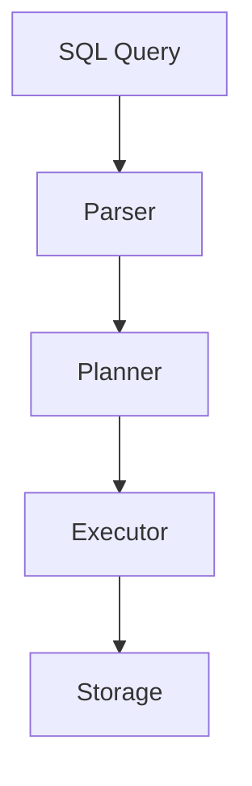

# Documentation Guide

## Overview

This directory contains comprehensive documentation tracking our journey building a FULL SQL:1999 compliant in-memory database.

## Documentation Philosophy

As we work through this unprecedented challenge, we maintain detailed documentation to:
- **Track decisions**: Why we chose specific approaches
- **Capture learning**: Insights gained during implementation
- **Document architecture**: System design and component interactions
- **Record progress**: What works, what doesn't, what's next
- **Enable future contributors**: Make the codebase understandable

## Directory Structure

```
docs/
├── README.md                    # This file - documentation guide
├── architecture/                # System design and architecture
│   ├── OVERVIEW.md             # High-level system architecture
│   ├── PARSER.md               # Parser design and grammar
│   ├── STORAGE.md              # Storage engine architecture
│   ├── EXECUTION.md            # Query execution engine
│   ├── TRANSACTIONS.md         # Transaction management
│   └── PROTOCOLS.md            # ODBC/JDBC implementation
├── implementation/              # Implementation guides and notes
│   ├── GETTING_STARTED.md      # Setup and build instructions
│   ├── FEATURES/               # Per-feature implementation notes
│   │   ├── E011_numeric.md    # Numeric types implementation
│   │   ├── F031_schema.md     # Schema operations
│   │   └── ...
│   ├── TESTING.md              # How to run and write tests
│   └── DEBUGGING.md            # Debugging tips and tools
├── research/                    # Research documents
│   ├── sql1999/                # SQL:1999 standard research
│   ├── competitors/            # Study of other databases
│   ├── algorithms/             # Query optimization, etc.
│   └── protocols/              # ODBC/JDBC research
├── decisions/                   # Architecture Decision Records (ADRs)
│   ├── 0001-language-choice.md
│   ├── 0002-parser-strategy.md
│   ├── 0003-storage-design.md
│   └── ...
└── lessons/                     # Lessons learned
    ├── WEEKLY.md               # Weekly progress and insights
    ├── CHALLENGES.md           # Major challenges and solutions
    └── GOTCHAS.md              # SQL:1999 edge cases and surprises
```

## Document Types

### 1. Architecture Documents
**Purpose**: Explain system design decisions and component architecture

**Location**: `docs/architecture/`

**Template**: See `ARCHITECTURE_TEMPLATE.md`

**When to create**:
- Designing a major component
- Refactoring system architecture
- Adding new subsystems

### 2. Implementation Guides
**Purpose**: Practical guides for implementing features

**Location**: `docs/implementation/`

**Template**: See `IMPLEMENTATION_TEMPLATE.md`

**When to create**:
- Starting implementation of a SQL:1999 feature
- Documenting complex implementation patterns
- Creating developer onboarding guides

### 3. Architecture Decision Records (ADRs)
**Purpose**: Record important decisions with context and rationale

**Location**: `docs/decisions/`

**Template**: See `ADR_TEMPLATE.md`

**Format**: Numbered sequentially (0001, 0002, etc.)

**When to create**:
- Choosing between multiple viable approaches
- Making decisions that are hard to reverse
- Trade-offs that need explanation

### 4. Research Notes
**Purpose**: Document research findings on SQL, databases, algorithms

**Location**: `docs/research/`

**When to create**:
- Researching SQL:1999 features
- Studying competitor implementations
- Learning about algorithms (query optimization, etc.)

### 5. Lessons Learned
**Purpose**: Capture insights, surprises, and hard-won knowledge

**Location**: `docs/lessons/`

**Template**: See `LESSONS_TEMPLATE.md`

**When to update**:
- Weekly retrospectives
- After solving difficult bugs
- Discovering SQL:1999 edge cases
- Learning from mistakes

## Documentation Standards

### Writing Style
- **Clear and concise**: Get to the point quickly
- **Code examples**: Show, don't just tell
- **Diagrams welcome**: ASCII art, mermaid, or images
- **Context matters**: Explain the "why" not just the "what"
- **Future-proof**: Write for someone reading this in 6 months

### Markdown Conventions
- Use `#` for titles, `##` for sections, `###` for subsections
- Code blocks with language hints: ```rust, ```sql
- Links to related docs: `[Storage Engine](../architecture/STORAGE.md)`
- Tables for comparisons
- Bullet points for lists
- Numbered lists for sequences

### Metadata Header
Each major document should start with:

```markdown
# Document Title

**Status**: Draft | In Progress | Complete | Deprecated
**Last Updated**: YYYY-MM-DD
**Author**: Primary author/contributor
**Related**: Links to related documents

## Quick Summary
One paragraph explaining what this document covers.
```

## Maintenance Guidelines

### Keep Documentation Current
- Update docs when code changes significantly
- Mark outdated docs as "Deprecated" with pointers to current info
- Review and update weekly during active development

### Link Between Documents
- Cross-reference related documents
- Create a "See Also" section
- Maintain bidirectional links when possible

### Version History
- Major document changes should be noted
- Consider using git commit messages for detailed history
- Optional: Add "Changelog" section to living documents

## Special Documents

### DECISIONS.md
Master index of all Architecture Decision Records with quick summary of each decision.

### LESSONS_LEARNED.md
Consolidated view of major lessons, challenges overcome, and insights gained.

### PROGRESS.md
Weekly or bi-weekly progress updates tracking what's done, what's next, blockers.

### COMPLIANCE.md
Feature-by-feature tracking of SQL:1999 compliance status (in root directory).

## Documentation Workflow

### When Starting New Work
1. **Research**: Document findings in `docs/research/`
2. **Decide**: Create ADR if multiple approaches exist
3. **Design**: Write architecture doc for the component
4. **Implement**: Create implementation guide as you code
5. **Reflect**: Update lessons learned with insights

### During Implementation
- Add comments to complex code
- Update implementation guides with discovered details
- Note edge cases in GOTCHAS.md
- Track progress in weekly updates

### After Completing Feature
- Mark docs as "Complete"
- Update COMPLIANCE.md with feature status
- Create summary in LESSONS_LEARNED.md
- Cross-link related documentation

## Documentation Tools

### Recommended
- **Markdown editors**: VS Code, Typora, or any text editor
- **Diagrams**: Mermaid (embedded in markdown), draw.io, ASCII art
- **Link checking**: markdown-link-check
- **Formatting**: prettier with markdown plugin

### Mermaid Diagram Example


## Getting Started

### For New Contributors
1. Read `GETTING_STARTED.md` in implementation/
2. Review architecture docs for system overview
3. Check DECISIONS.md for context on key choices
4. Look at LESSONS_LEARNED.md for pitfalls to avoid

### For AI Assistants (Claude Code)
When working on this project:
1. **Always document decisions**: Create ADRs for significant choices
2. **Update implementation guides**: Keep docs in sync with code
3. **Note lessons learned**: Document surprises and insights
4. **Cross-reference**: Link related documents together
5. **Be thorough**: This is a learning journey, capture everything

## Examples

See the `examples/` subdirectory for:
- Sample ADR
- Sample architecture document
- Sample implementation guide
- Sample lessons learned entry

## Questions?

If documentation structure or standards are unclear:
1. Look at existing docs as examples
2. Follow the templates
3. When in doubt, over-document rather than under-document
4. Improve this guide as you learn what works

---

**Remember**: We're building something unprecedented. Good documentation is as important as good code!
