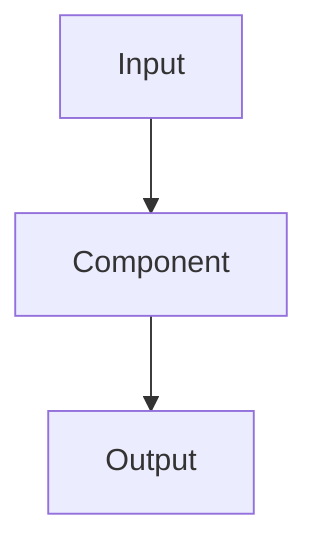

# [Component Name] Architecture

**Status**: Draft | In Progress | Complete | Deprecated

**Last Updated**: YYYY-MM-DD

**Owner**: [Primary maintainer]

**Related**:
- [Link to related architecture docs]
- [Link to implementation guide]
- [Link to relevant ADRs]

## Quick Summary

[One paragraph: What is this component? What problem does it solve? How does it fit into the overall system?]

## Goals and Non-Goals

### Goals
* [Goal 1: What this component should do]
* [Goal 2: Key requirement]
* [Goal 3: Important capability]

### Non-Goals
* [Non-goal 1: What this component explicitly does NOT do]
* [Non-goal 2: Out of scope]

## High-Level Design

[Describe the overall design approach. Include diagrams if helpful.]



Or ASCII art:
```
┌─────────────┐
│   Parser    │
│             │
│  Tokenizer  │
│     ↓       │
│  Grammar    │
│     ↓       │
│   AST       │
└─────────────┘
```

## Component Structure

### Major Subcomponents

#### Subcomponent 1: [Name]
**Purpose**: [What it does]

**Responsibilities**:
* [Responsibility 1]
* [Responsibility 2]

**Interface**: [How other components interact with it]

#### Subcomponent 2: [Name]
[Same structure]

## Data Model

[Describe key data structures, types, and their relationships]

```rust
// Example
pub struct Query {
    pub statements: Vec<Statement>,
}

pub enum Statement {
    Select(SelectStmt),
    Insert(InsertStmt),
    // ...
}
```

## Interfaces

### Public API

```rust
// What functions/methods are exposed to other components?
pub trait QueryExecutor {
    fn execute(&self, query: Query) -> Result<ResultSet>;
}
```

### Dependencies

[What other components does this depend on?]

* **Component A**: Used for [purpose]
* **Component B**: Provides [capability]

### Dependents

[What other components depend on this?]

* **Component X**: Uses this for [purpose]
* **Component Y**: Relies on [capability]

## Key Algorithms

### Algorithm 1: [Name]

**Purpose**: [What problem does it solve?]

**Approach**: [High-level description]

**Complexity**: Time O(?), Space O(?)

**Pseudocode** (optional):
```
function algorithm(input):
    // steps
    return output
```

## Error Handling

[How does this component handle errors? What errors can it produce?]

Example:
```rust
pub enum ParserError {
    SyntaxError { line: usize, column: usize, message: String },
    UnexpectedToken { expected: String, found: String },
    // ...
}
```

## Performance Considerations

### Bottlenecks
* [Known or expected bottlenecks]

### Optimizations
* [Optimizations implemented or planned]

### Benchmarks
* [Key performance metrics and targets]

## Testing Strategy

### Unit Tests
[What should be unit tested?]

### Integration Tests
[What integration tests are needed?]

### Test Cases
[Key test scenarios]

1. [Test case 1]
2. [Test case 2]

## SQL:1999 Compliance

[Which SQL:1999 features does this component support?]

| Feature ID | Feature Name | Status | Notes |
|------------|--------------|--------|-------|
| E011 | Numeric types | ✅ Complete | All types supported |
| F031 | Basic schema | 🚧 In progress | DROP not implemented |

## Future Enhancements

### Short-term (Next Sprint/Month)
* [Enhancement 1]
* [Enhancement 2]

### Long-term (Future)
* [Enhancement 3]
* [Enhancement 4]

## Known Issues and Limitations

* **Issue 1**: [Description and workaround]
* **Issue 2**: [Description and impact]

## References

### SQL:1999 Standard
* Part X, Section Y: [Relevant sections]

### Research Papers
* [Relevant academic papers]

### External Resources
* [Helpful blog posts, documentation, etc.]

### Related Code
* [Links to similar implementations in other projects]

## Changelog

### YYYY-MM-DD - [Author]
[Major changes to this document or component]

### YYYY-MM-DD - [Author]
[Previous changes]
